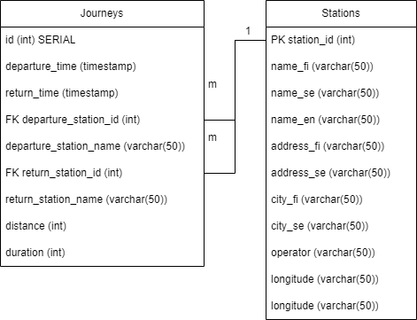

# Instructions

## Docker

#### Requirements
- JDK 17
- Docker
- Docker compose

To run the backend in Docker, in backend directory run:
```
./getCSVfiles.sh
./gradlew build -x test
docker build -t app.jar .
docker-compose up -d
curl http://localhost:8081/parse
```
To stop the process, run "docker-compose down".
To clear the contained database, run "docker-compose down --volumes".

Explained:
1. Creates resources/data folder, and downloads CSV files there
2. Builds app
3. Creates docker image from app
4. Starts PostgreSQL and backend containers
5. Tells the server to start parsing CSV files. This should take around 5 minutes.

## Without Docker

#### Requirements
- PostgreSQL 15
- JDK 17

PostgreSQL needs to be up before running the backend.

Database connection defaults to following:

```
DB_URL=postgresql://localhost:5432/postgres
DB_USERNAME=postgres
DB_PASSWORD=password
```

If you want to set your own env variables, feel free to do so!

Commands to run the server:
```
./getCSVfiles.sh
./gradlew bootRun
curl http://localhost:8081/parse
```

Explained:
1. Creates resources/data folder, and downloads files there
2. Builds app
5. Tells the server to start parsing CSV files. This should take around 5 minutes.


# Database layout
